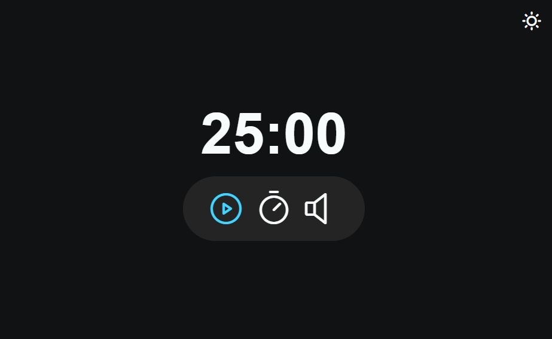

# Focus Timer

## Sobre o Projeto

Este é um projeto ao estilo pomodoro, desenvolvido como parte de um curso para praticar conceitos de HTML, CSS e JavaScript, incluindo light e dark mode, sons nos botões e acessibilidade para sr-only.

## Funcionalidades

- Configuração do tempo de trabalho.
- Iniciar, pausar e reiniciar o timer.
- Indicador visual do tempo restante.
- Suporte para light e dark mode.
- Sons nos botões.
- Acessibilidade para sr-only.

## Estrutura do Projeto

O projeto possui a seguinte estrutura:

- `index.html`: O arquivo HTML principal que contém a estrutura da página.
- `style.css`: Um arquivo CSS para estilizar a página.
- `script.js`: Um arquivo JavaScript que contém a lógica do Focus Timer.

## Como Usar

1. Faça o download ou clone este repositório em sua máquina local.
2. Abra o arquivo `index.html` em qualquer navegador web.
3. Configure o tempo de trabalho e o tempo de pausa desejados.
4. Clique no botão "Iniciar" para iniciar o timer.
5. O timer irá alternar entre o tempo de trabalho e o tempo de pausa até ser parado manualmente.

## Recursos Utilizados

- HTML
- CSS
- JavaScript

## Contribuição

Este é um projeto simples desenvolvido como parte de um curso. Contribuições são bem-vindas por meio de pull requests. Para grandes mudanças, por favor, abra uma issue primeiro para discutir o que você gostaria de mudar.

## Contato

Se tiver alguma dúvida ou sugestão relacionada a este projeto, sinta-se à vontade para entrar em contato.
